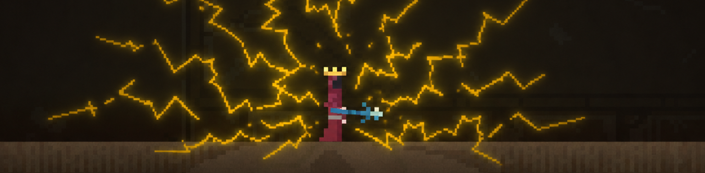

# Noita OpenShock Integration

A Noita mod that makes combat feel more immediate by sending shock or vibration signals directly into your body when taking damage or dying.

This mod is designed to work with OpenShock, a free and open-source software platform that allows you to connect various devices. You can find more information about OpenShock and how to set it up on their website: [openshock.org](https://openshock.org)

## Installation

1. Download the latest release from the releases tab
2. Copy the contents of the zip file to your Noita mods folder (usually located at `C:\Program Files (x86)\Steam\steamapps\common\Noita\mods`)
3. Start Noita and enable the "OpenShock Integration" mod in the mod menu

## Notes

Edit `config_override.txt` to skip Noita's limited mod settings UI and set the config values directly. This is recommended since some of the config values are quite long and unwieldy to edit through the in-game UI.

## Build from source

1. Clone the repository
2. Run `copy-project.ps1 -Destination "Path/To/Noita/mods/openshock_integration"` to copy the project files to your Noita mods folder (respects .copyignore)
3. Start Noita and enable the "OpenShock Integration" mod in the mod menu

## Credits
- ProjectBots - Coding
- Conga Lyne - Project Template (Fungal Pain mod)
- probable-basilisk - pollnet (Lua library for networking)

## License

See [LICENSE](LICENSE)
